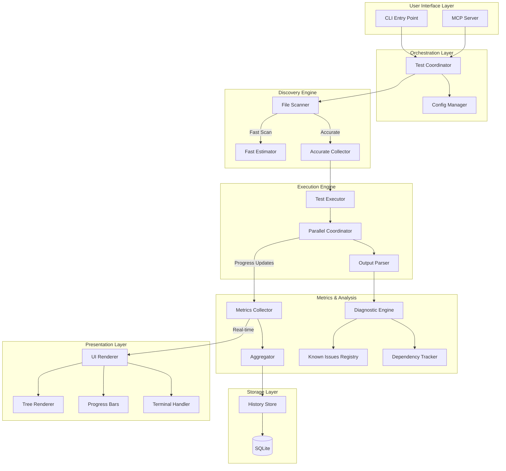
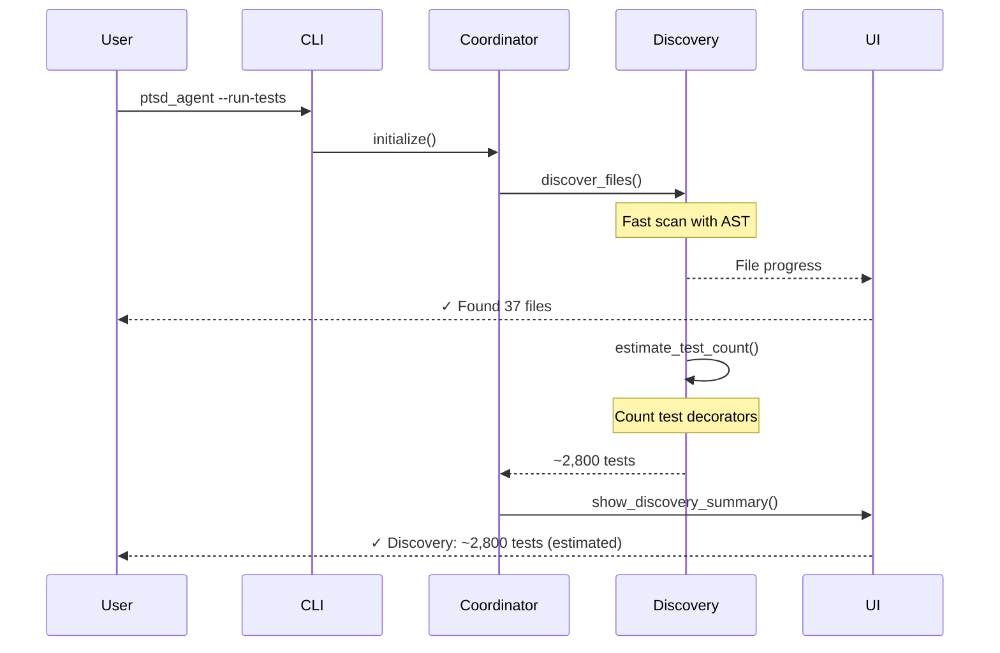
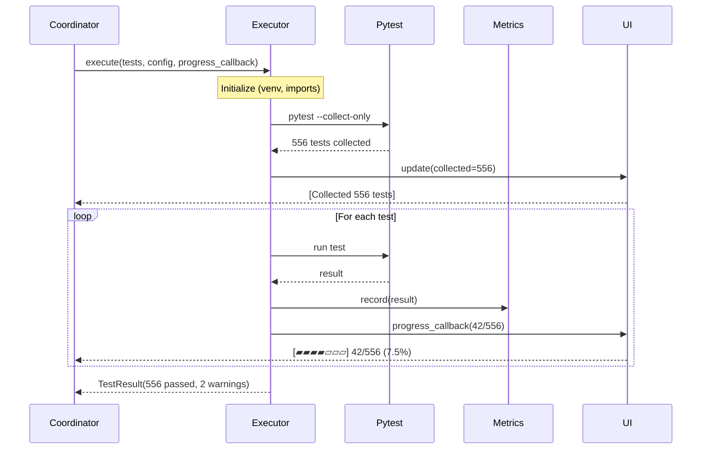
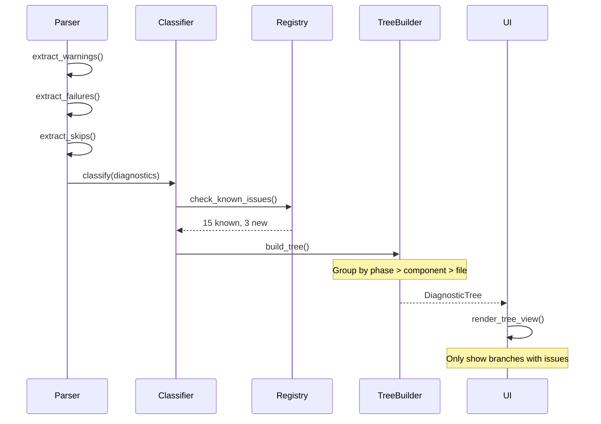

# PTSD Agent Architecture

## System Overview

PTSD Agent is a modular, contracts-first universal test runner with rich diagnostics.



## Core Components

### 1. Discovery Engine

**Purpose**: Find and enumerate tests quickly and accurately.

**Two-Phase Approach**:
1. **Fast Estimation** - AST parsing to count test functions (~500ms for 3000 tests)
2. **Accurate Collection** - Pytest collection during initialization (~5s for 3000 tests)

**Files**:
- `discovery/base.py` - TestDiscoverer protocol
- `discovery/pytest.py` - Pytest implementation
- `discovery/approximator.py` - Fast AST-based estimation

**Why Two Phases?**
- Fast scan provides immediate feedback ("~2,800 tests discovered")
- Accurate collection happens during test initialization (venv setup time)
- Avoids duplicate collection

### 2. Execution Engine

**Purpose**: Run tests with parallel execution and real-time progress.

**Key Features**:
- Component-level parallelism (12 components in parallel)
- Test-level parallelism (pytest-xdist within component)
- VirtualEnv detection for project-specific dependencies
- Progress callbacks for accurate UI updates

**Files**:
- `execution/base.py` - TestExecutor protocol
- `execution/pytest.py` - Pytest implementation
- `execution/parallel.py` - Parallel coordinator

**Progress Tracking**:
```python
# Executor sends progress updates after each test
progress_callback(ProgressUpdate(
    test_name="test_authentication",
    status=TestStatus.PASSED,
    completed_count=42,
    total_count=556,
    duration=0.15
))

# UI receives update and re-renders progress bar immediately
# ⠋ training_orchestrator [test_authentication] [▰▰▰▰▱▱▱] 42/556 (7.5%)
```

### 3. Metrics Collection

**Purpose**: Aggregate test results across components and phases.

**Hierarchy**:
```
TestRunSummary
└── PhaseMetrics[]
    └── ComponentMetrics[]
        └── TestResult[]
            └── Diagnostics
```

**Files**:
- `metrics/collector.py` - Main collector
- `metrics/aggregator.py` - Cross-component aggregation
- `metrics/models.py` - Data models

### 4. Diagnostic Engine

**Purpose**: Parse, classify, and display test failures/warnings/errors/skips.

**Components**:
- **Parser** - Extract diagnostics from pytest output
- **Classifier** - Categorize issues (import error, assertion failure, etc.)
- **Registry** - Track known issues
- **Dependency Tracker** - Link skips to blocking components

**Files**:
- `diagnostics/parser.py` - Output parsing
- `diagnostics/classifier.py` - Issue classification
- `diagnostics/registry.py` - Known issues
- `dependencies/graph.py` - Dependency tracking

### 5. Terminal UI

**Purpose**: Beautiful, informative terminal interface with tree views.

**Rendering Approach**:
- Uses `blessed` library for terminal control
- Handles resize events gracefully
- Real-time progress updates (not clearing/redrawing entire screen)
- Tree view for diagnostics matching test hierarchy

**Files**:
- `ui/terminal.py` - Terminal abstraction
- `ui/renderer.py` - Main UI coordinator
- `ui/tree.py` - Tree rendering
- `ui/progress.py` - Progress bars

### 6. Storage Layer

**Purpose**: Persist test run history for trends and comparison.

**Database Schema**:
- `test_runs` - Run metadata
- `component_results` - Per-component metrics
- `test_results` - Individual test results
- `diagnostics` - Warnings/errors/failures/skips

**Files**:
- `storage/database.py` - SQLAlchemy setup
- `storage/models.py` - ORM models
- `storage/history.py` - History API

## Data Flow

### Discovery Phase



### Execution Phase with Accurate Progress



### Diagnostic Processing



## Extension Points

### Adding New Test Framework

1. **Create discoverer**: `discovery/jest.py`
2. **Create executor**: `execution/jest.py`
3. **Register in config schema**
4. **Add file patterns** (*.test.js)

### Adding New Diagnostic Type

1. **Extend DiagnosticType** enum
2. **Add parser** in `diagnostics/parser.py`
3. **Add classifier rules** in `diagnostics/classifier.py`
4. **Update UI rendering**

### Adding New UI Section

1. **Define UISection** protocol
2. **Implement renderer** in `ui/sections/`
3. **Register in UIRenderer**

## Configuration System

### Hierarchy

```
Default Config
↓
.ptsd.yaml (project root)
↓
CLI Arguments
```

CLI args override config file, config file overrides defaults.

### Schema

```yaml
project:
  name: string
  root: path
  
structure:
  type: "phases" | "flat" | "custom"
  phases: [...] | null
  
discovery:
  patterns: list[str]
  exclude: list[str]
  approximate: bool  # Use fast estimation
  
execution:
  parallel_workers: int
  framework: str
  venv_detection: bool
  custom_command: str | null
  
  pytest:
    args: list[str]
    plugins: list[str]
    
diagnostics:
  show_known_issues: bool
  tree_view: bool
  
storage:
  database: path
  retention_days: int
  
dependencies:
  [component_name]:
    blocks: list[str]
    auto_retest: bool
```

## Performance Considerations

1. **Discovery** - Fast AST scan (~500ms) before slow pytest collection
2. **Parallel Execution** - Component-level + test-level parallelism
3. **Progress Updates** - Callback-based (not polling) for CPU efficiency
4. **UI Rendering** - Incremental updates (not full redraw)
5. **Database** - Batch inserts for history storage

## Testing Strategy

PTSD Agent tests itself:
- Unit tests for each module
- Integration tests running against fixture projects
- Meta-testing (PTSD Agent running PTSD Agent's tests)
